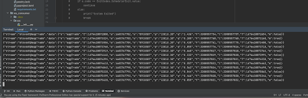

# trend-activated-trailing-stop-loss-bot
A Technical Analysis employing test of the Unicorn Binance Trailing Stop Loss Engine within Binance's Futures Exchange

## Installation
Make sure to have Conda installed as it allows for easy virtual environment management creation and replication

### Conda Environment Creation
Open up a command line interface and from the root directory of the project run:
```
conda env create -f environment.yml
```
This will create the conda environment for you to the correct specifications. Then run:
```
conda activate trend_activated_bot_env
```
This will activate the conda environment for you. Now run:
```
poetry build
```
to build the project. Now you can spin up the remote server by running:
```
python ws_consumer/src/server.py
```
You are able to now run the project! Either open up another command line interface and, from the root directory of the project run:
```
python trend_activated_app/main.py
```
to stream data to your local machine. You can also use your favorite IDE, such as PyCharm, by setting its project Python Interpreter to the created trend_activated_bot_env Conda environment.


## Execute
```
$ export API_KEY="aaa"
$ export API_SECRET="bbb"
$ ./main.py
```
